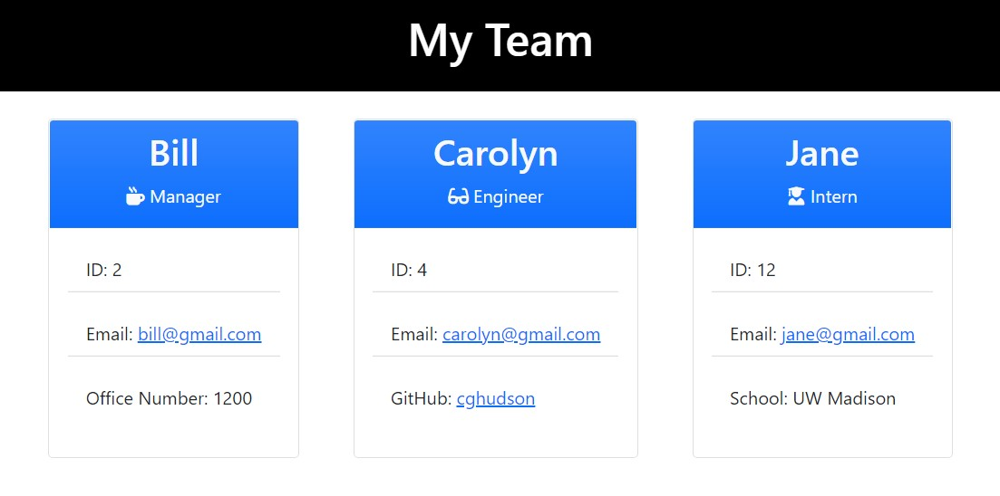

# Team Profile Generator
  

  ## Description

  This application is invoked using the command "node index.js". The user will be prompted to enter information for team members including a Manager, Engineers, and Interns. The user will input the Manager's name, ID, email, and office number. Then the user will be prompted with menu options to enter an Engineer, enter an Intern, or finish creating the team. The Engineer's information includes name, ID, email, and GitHub Username. The Intern's infromation includes name, ID, email, and school. When the option to finish creating the team is selected, a HTML file will be created that displays all of the inputted information. 

  ## Table of Contents
  * [Built With](#built-with)
  * [Installation](#installation)
  * [Usage](#usage)
  * [License](#license)
  * [Contributing](#contributing)
  * [Tests](#tests)
  * [Questions](#questions)
  
  ## Built With

  - HTML
  - CSS
  - Font Awesome
  - JavaScript
  - Node.js

  ## Installation

  To run any necessary installations use the following command:

```
  npm install
```

  ## Usage

  The purpose of this project is to allow users to generate a webpage using the command-line that displays their team's basic information.

  ## Preview:

  The following GIF demonstrates the Team Profile Generator's appearance and functionality:

  

  https://drive.google.com/file/d/1ADkz30Zw36qpARqAlIKVKqDnXQCT0qRW/view

  Image example of generated Team Profile:

  

  ## License

   This application is licensed under MIT.
   
  ## Contributing

  Contributions are welcome! See below for instructions:

  1. **Fork** the repository on GitHub.
  2. **Clone** the project to your device.
  3. **Commit** changes to your own branch.
  4. **Push** the changes to your fork.
  5. Submit a **Pull request** so that the changes can be reviewed!

  ## Tests
  
  To run any necessary test, use the following command:

```
  npm run test
```

  ## Questions

If you have any questions about this project please email me directly at [cghudson@uwalumni.com](mailto:cghudson@uwalumni.com) .

View more of my projects on [GitHub](https://github.com/cghudson).